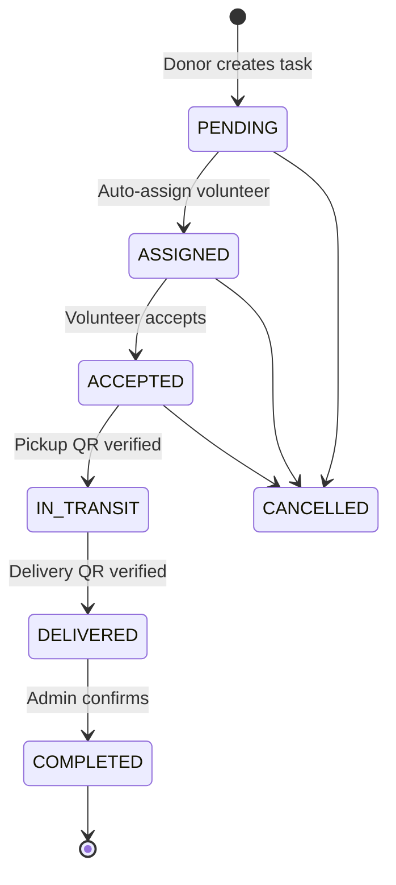

# Unified Food Rescue Platform

> **Integration of 4 separate food rescue systems into a single unified backend**

## 🎯 Project Overview

This is a **unified backend system** that integrates food rescue operations across:
- **Donors** - Individuals/organizations donating surplus food
- **NGOs** - Non-profit organizations receiving donations
- **Volunteers** - Delivery personnel transporting food
- **Admin/Dispatchers** - System administrators managing operations

### Team Integration

This project integrates **4 separate codebases** built by your team:
1. **M7_Logistics_System** - Volunteer tracking with real-time GPS
2. **food-rescue-platform-main** - Donor management
3. **food-rescue-platform-ngo-portal** - NGO verification & management
4. **food-rescue-platform-donation** - Donation forms

## 🏗️ Architecture

### Technology Stack

**Backend:**
- FastAPI (Python 3.10+)
- PostgreSQL 15 + PostGIS (Supabase)
- SQLAlchemy ORM
- Redis (optional caching)

**Frontend (Existing):**
- Flutter (3 mobile apps)
- React.js (dispatcher dashboard)
- Google Maps API (maps & navigation)

**Authentication:**
- JWT tokens (Clerk-ready architecture)
- Firebase (push notifications)

### Database Schema

10 core tables:
- `users` - Unified user accounts (Clerk integration)
- `donors` - Donor profiles with location
- `ngos` - NGO profiles with verification status
- `ngo_branches` - NGO branch locations
- `volunteers` - Volunteer profiles with vehicle info
- `tasks` - Donation tasks with QR verification
- `tracking_sessions` - Real-time GPS tracking
- `task_exceptions` - Issue tracking
- `performance_stats` - Analytics
- `admin_actions` - Audit logs

### Key Features

✅ **Spatial Auto-Assignment**
- PostGIS-powered nearest volunteer matching
- Configurable distance radius (default: 10km)
- Automatic task assignment on creation

✅ **Real-Time Tracking**
- GPS coordinate logging during delivery
- WebSocket support (ready)
- Path visualization

✅ **QR Code Verification**
- Dual QR system (pickup + delivery)
- Prevents fraud
- Timestamped verification

✅ **Multi-Role Authentication**
- JWT-based authentication
- Role-based access control (DONOR, NGO, VOLUNTEER, ADMIN)
- Clerk integration ready

✅ **NGO Verification System**
- Document upload
- License verification
- Approval workflow

## 📁 Project Structure

```
final/
├── backend/
│   ├── main.py                 # FastAPI application
│   ├── config.py               # Configuration management
│   ├── database.py             # SQLAlchemy setup
│   ├── requirements.txt        # Python dependencies
│   ├── .env                    # Environment variables
│   │
│   ├── api/
│   │   └── v1/
│   │       ├── auth.py         # Authentication endpoints
│   │       ├── donors.py       # Donor CRUD + task creation
│   │       ├── ngos.py         # NGO management + verification
│   │       ├── volunteers.py   # Volunteer location tracking
│   │       └── tasks.py        # Task workflow + QR verification
│   │
│   ├── models/
│   │   └── __init__.py         # SQLAlchemy ORM models
│   │
│   ├── schemas/
│   │   └── __init__.py         # Pydantic validation schemas
│   │
│   ├── services/
│   │   └── assignment.py       # Auto-assignment logic
│   │
│   └── utils/
│       ├── auth.py             # JWT authentication
│       ├── spatial.py          # PostGIS spatial queries
│       └── qr_generator.py     # QR token generation
│
├── nexd/                     # Next.js Web Dashboard (Admin/Dispatcher/NGO)
│
├── mobile/                   # Flutter Mobile App (Donor/Volunteer/NGO)
│
├── database/
│   └── schema.sql              # PostgreSQL schema with PostGIS
│
├── docs/
│   └── (documentation)
│
├── SETUP_GUIDE.md              # Detailed setup instructions
└── README.md                   # This file
```

## 🚀 Quick Start

### Prerequisites

✅ **Supabase Database** (Already configured!)
- Host: `db.bwrwszeftkiwbybolzrh.supabase.co`
- Database: `postgres`
- PostGIS extension enabled

✅ **Python 3.10+**

### 1. Database Setup (Automated)

```powershell
# Run setup script from final/ directory
cd C:\Users\sister\Documents\SE-VOLUNTEER\final
.\setup_database.ps1
```

**What it does:**
- ✅ Tests Supabase connection
- ✅ Enables PostGIS + UUID extensions
- ✅ Creates all 10 tables
- ✅ Verifies setup

**Alternative (Manual):**
See [QUICKSTART_SUPABASE.md](QUICKSTART_SUPABASE.md)

### 2. Python Setup

```powershell
cd backend
python -m venv venv
.\venv\Scripts\Activate.ps1
pip install -r requirements.txt
```

### 3. Run Backend

```powershell
python main.py
```

Visit: http://localhost:8000/docs

**📖 Full setup guide:** See [SETUP_GUIDE.md](SETUP_GUIDE.md)

## 🔌 API Endpoints

### Authentication
- `POST /api/v1/auth/register` - Register user
- `POST /api/v1/auth/login` - Login (get JWT token)
- `GET /api/v1/auth/me` - Get current user

### Donors
- `POST /api/v1/donors/` - Create donor profile
- `GET /api/v1/donors/me` - Get my profile
- `POST /api/v1/donors/tasks` - Create donation task (auto-assigns volunteer)
- `GET /api/v1/donors/tasks` - Get my tasks

### NGOs
- `POST /api/v1/ngos/` - Create NGO profile
- `GET /api/v1/ngos/me` - Get my profile
- `GET /api/v1/ngos/nearby-tasks` - Find nearby donations
- `POST /api/v1/ngos/tasks/{id}/claim` - Claim a task
- `GET /api/v1/ngos/tasks` - Get my tasks

### Volunteers
- `POST /api/v1/volunteers/` - Create volunteer profile
- `GET /api/v1/volunteers/me` - Get my profile
- `POST /api/v1/volunteers/go-online` - Start accepting tasks
- `POST /api/v1/volunteers/go-offline` - Stop accepting tasks
- `PATCH /api/v1/volunteers/location` - Update GPS location
- `PATCH /api/v1/volunteers/status` - Update status
- `GET /api/v1/volunteers/current-task` - Get assigned task
- `GET /api/v1/volunteers/task-history` - Get completed tasks

### Tasks
- `GET /api/v1/tasks/` - Get all tasks (admin only)
- `GET /api/v1/tasks/{id}` - Get task details
- `POST /api/v1/tasks/{id}/accept` - Volunteer accepts task
- `POST /api/v1/tasks/{id}/pickup-verify` - Verify pickup QR
- `POST /api/v1/tasks/{id}/delivery-verify` - Verify delivery QR
- `POST /api/v1/tasks/{id}/complete` - Mark complete (admin)
- `POST /api/v1/tasks/{id}/cancel` - Cancel task
- `POST /api/v1/tasks/auto-assign` - Trigger auto-assignment (admin)
- `POST /api/v1/tasks/{id}/reassign` - Reassign to another volunteer (admin)

## 🔄 Task Workflow



## 📊 Spatial Features

### Auto-Assignment Algorithm

1. Donor creates task with pickup location
2. System queries PostGIS for volunteers within 10km radius
3. Filters for AVAILABLE status
4. Calculates distance using Haversine formula
5. Assigns to nearest volunteer
6. Creates tracking session

### Spatial Queries

```python
# Find nearby volunteers (uses PostGIS ST_DWithin)
find_nearby_volunteers(db, lat, lng, max_distance_km=10)

# Find nearby tasks for NGO
find_nearby_tasks(db, lat, lng, max_distance_km=10)

# Calculate distance
calculate_distance_km(lat1, lng1, lat2, lng2)  # Haversine
```

## 🔐 Authentication

### JWT Flow

1. User registers: `POST /api/v1/auth/register`
2. User logs in: `POST /api/v1/auth/login` → returns `access_token`
3. Include token in requests: `Authorization: Bearer <token>`
4. Backend validates token and extracts user info

### Clerk Integration (Optional)

Architecture supports Clerk authentication:
- `clerk_user_id` field in users table
- JWT verification compatible with Clerk JWTs
- Can add Clerk SDK to frontends later

## 🧪 Testing

### Test Data

Create test users for each role:

```powershell
# Donor
curl -X POST http://localhost:8000/api/v1/auth/register \
  -H "Content-Type: application/json" \
  -d '{"email":"donor@test.com","full_name":"Test Donor","role":"DONOR","password":"test123"}'

# NGO
curl -X POST http://localhost:8000/api/v1/auth/register \
  -H "Content-Type: application/json" \
  -d '{"email":"ngo@test.com","full_name":"Test NGO","role":"NGO","password":"test123"}'

# Volunteer
curl -X POST http://localhost:8000/api/v1/auth/register \
  -H "Content-Type: application/json" \
  -d '{"email":"volunteer@test.com","full_name":"Test Volunteer","role":"VOLUNTEER","password":"test123"}'
```

### Complete Workflow Test

See [SETUP_GUIDE.md - Step 7](SETUP_GUIDE.md#step-7-test-complete-workflow) for full workflow testing.

## 🔗 Frontend Integration

### Update API Base URL

All 4 frontends need to update API endpoint:

**Flutter Apps:**
```dart
const String API_BASE_URL = 'http://localhost:8000/api/v1';
// Or production: 'https://your-domain.com/api/v1'
```

**React Dashboard:**
```javascript
const API_BASE_URL = 'http://localhost:8000/api/v1';
```

### Add Authentication

1. Login endpoint: `POST /api/v1/auth/login`
2. Store JWT token in localStorage/secure storage
3. Add Authorization header to all requests:
   ```
   Authorization: Bearer <token>
   ```

### Update Endpoints

| Old System | New Unified Endpoint |
|-----------|---------------------|
| M7: `/tasks` | `/api/v1/volunteers/current-task` |
| M7: `/update-location` | `/api/v1/volunteers/location` |
| NGO Portal: `/ngos` | `/api/v1/ngos/` |
| Donation: `/donate` | `/api/v1/donors/tasks` |

## 📝 Migration from Old Systems

### Data Export

Export existing data from 4 separate databases:
- Users
- Donors
- NGOs
- Volunteers
- Tasks

### Data Transform

- Convert Firebase UIDs → Clerk User IDs (or UUIDs)
- Convert serial IDs → UUIDs
- Normalize address → PostGIS coordinates

### Data Import

Use SQL INSERT or Python script to import into unified database.

## 🌍 Deployment

### Production Checklist

- [ ] Set up production PostgreSQL database
- [ ] Generate secure SECRET_KEY
- [ ] Configure production CORS_ORIGINS
- [ ] Set up Redis (optional)
- [ ] Enable HTTPS
- [ ] Set up nginx reverse proxy
- [ ] Configure firewall rules
- [ ] Set up database backups
- [ ] Add logging service
- [ ] Add monitoring (Sentry, New Relic)

### Docker Deployment (Coming Soon)

```yaml
# docker-compose.yml for full stack deployment
```

## 👥 Team Credits

**Integration Lead:** Your Name

**Original Systems:**
- M7 Logistics System (Volunteer Tracking)
- Food Rescue Platform Main (Donor Management)
- Food Rescue Platform NGO Portal (NGO Verification)
- Food Rescue Platform Donation (Donation Forms)

## 📄 License

[Your License]

## 🆘 Support

- **Setup Issues:** See [SETUP_GUIDE.md](SETUP_GUIDE.md)
- **API Documentation:** http://localhost:8000/docs
- **Database Schema:** See [database/schema.sql](database/schema.sql)

---

**Status:** ✅ Backend Complete | ✅ Frontend Complete (Next.js) | ✅ Mobile App Complete (Flutter)
**Last Updated:** 2026
